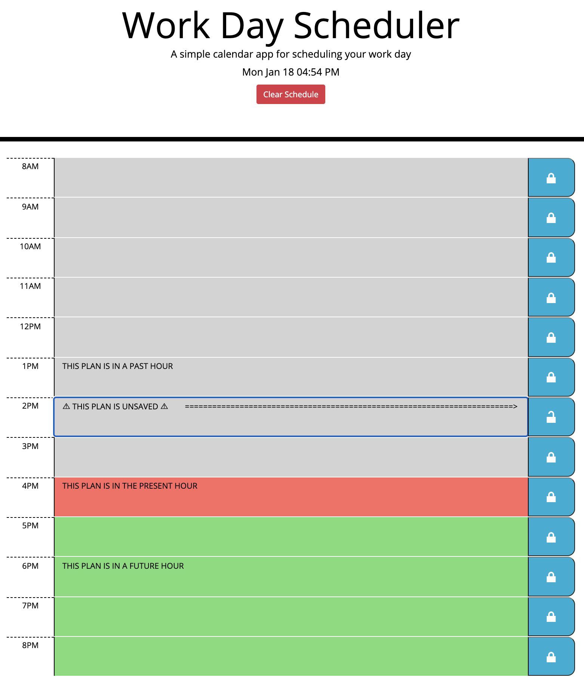
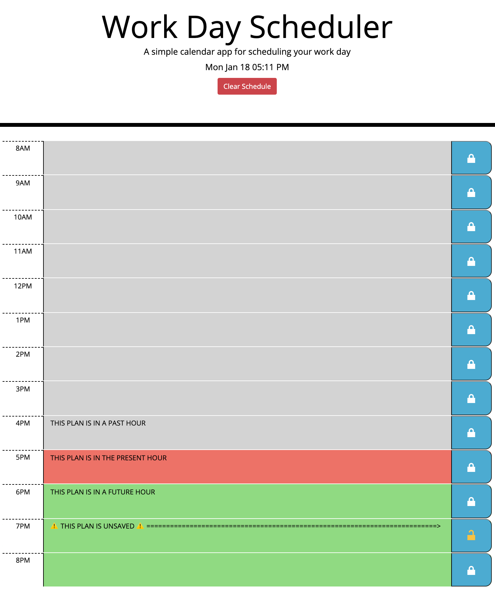

# Work Day Scheduler

## Description
<<<<<<< HEAD
* Work Day Scheduler is a daily planner
=======
* Work Day Scheduler is a daily planner. 
>>>>>>> develop
* Add plans to any hour between 8am and 8pm
* Save plans by clicking the `Lock Icon`

## Features
* Current day displayed above planner
* Hourly `time blocks` color coated for past, present and future
* Editable `time blocks`
* Saved `time blocks` persist on refresh
* ⚠️🔒⚠️: If a `Lock Icon` is unlocked, that `time block` is unsaved and will not persist on page refresh

## Look
<<<<<<< HEAD

## Links
- [Deployed Application](https://matt-gross-27.github.io/daily-planner/)
- [GitHub Repository](https://github.com/matt-gross-27/daily-planner)
=======

## Links
- [Deployed Application](https://matt-gross-27.github.io/daily-planner/)
- [GitHub Repository](https://github.com/matt-gross-27/daily-planner)

>>>>>>> develop
